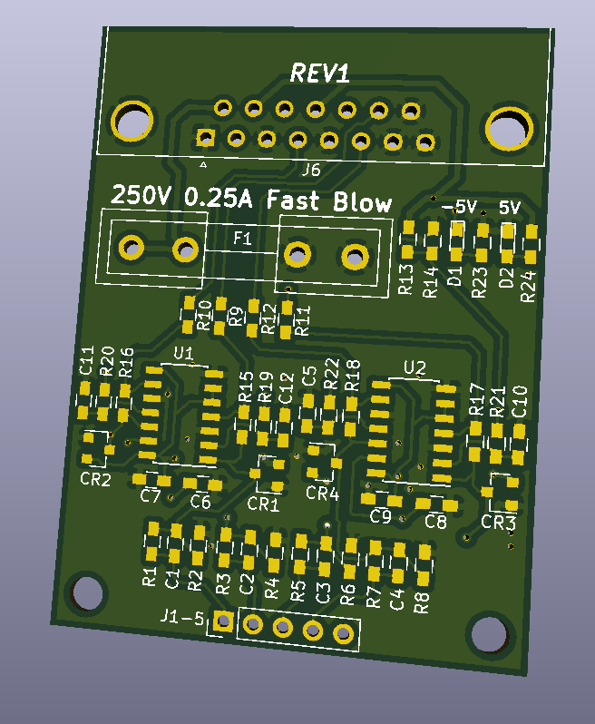
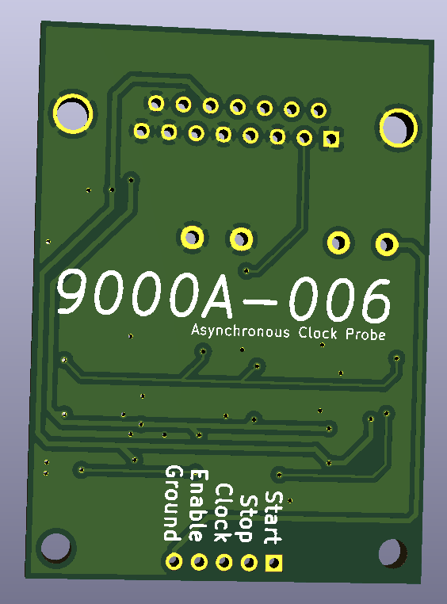

# 9000A-006_ClockModule
Reproduction Fluke 9000a Async clock module for Fluke 9010a devices with option 006

*design has not been completely tested, however it follows the original design schematics*

The cable used to hook up the module to the 9010 is just a DB15 male to DB15 male.

Front:  

Back:  

